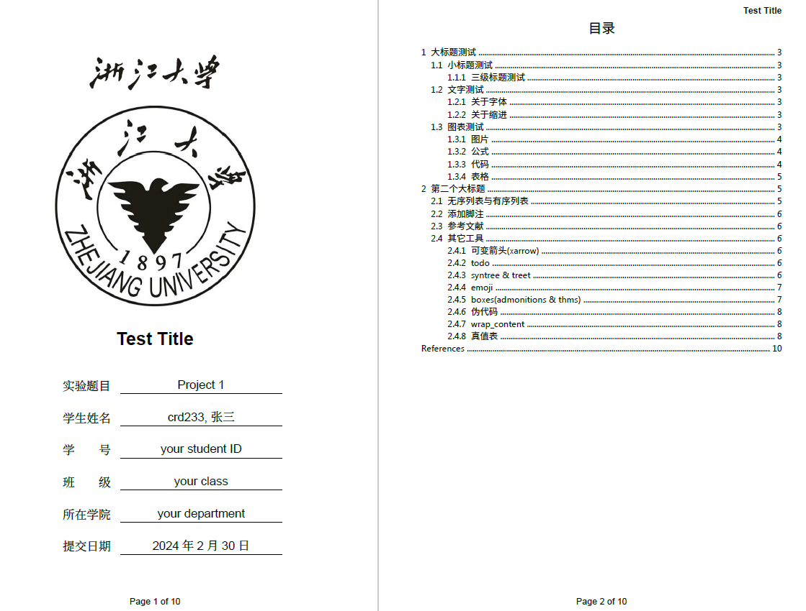

# my-typst-template
- A typst template for course report, desighed as a student in Chinese Zhejiang University, and is easy to modify.
- 这个 typst 模板是用于课程实验报告的、基于浙江大学(ZJU)学子身份设计的模板，集成了几个相对实用的包，对中英文混排做一定优化。
- 建议在本地 VSCode 中使用 typst-lsp (or [tinymist](https://github.com/Myriad-Dreamin/tinymist.git)) 和 typst-preview 插件，以获得最佳体验。
- 在直接开始使用前，你可能需要下载字体等，可以根据报错定位缺少哪些部分。

## 声明
- 本模板是在 [浙江工业大学实验报告模板](https://github.com/zjutjh/zjut-report-typst) 和 [南京大学学位论文模板](https://github.com/nju-lug/nju-thesis-typst) 的基础上修改而来的。
- 使用了自己编写的基于 showybox 的 [admonitions](https://github.com/crd2333/typst-admonition)、[theorems boxes](https://github.com/crd2333/typst-theorem-box)。
- 并且使用到了 [typst-svg-emoji](https://github.com/polazarus/typst-svg-emoji)、[typst-todo](https://github.com/jeffa5/typst-todo)这两个不收录在官方 preview 的包。

## 特点(feature)
- 根据个人使用习惯，对封面页设置了"report"和"normal"类型，并支持匿名实验报告；
- 拥有一键添加封面与目录、语言切换、图表分章节自动计数等功能；
- 优化了中西文混排、图文混排；
- 整合了一些方便实用的第三方包在内，便于使用。
  - 优化（添加）功能包括：图、表、代码、伪代码、公式、admonitions、theorems、todo、emoji、树形图、真值表等。
- 通过更改校徽和校名并调整大小，你也可以很方便地将其改为你的学校。
- 具体使用方法，可以参考 `example.typ`。
    

- Change logs
1. 2024.2.1：Initial commit
2. 2024.2.1：Add README and first publish
3. 2024.2.27：根据不同课程报告添加不同report类型并略微调整代码
4. 2024.3.1：修改几个bug
5. 2024.3.1：删除没用的文件
6. 2024.3.3：加入几个新的第三方包，修改代码部分组织方式，修改margin
7. 2024.3.3：修bug
8. 2024.3.8：解决中西文空格问题，添加中文斜体解决方案，添加thms包
9. 2024.3.8：优化部分编排
10. 2024.3.9：再次添加几个包，重构部分代码，重新上传整个仓库
11. 2024.3.10：typst 0.11.0 发布，根据新版的 template 要求重新组织结构
12. 2024.4.1：调整表格为 0.11.0 的 built-in 表格及一些细节修改
13. 2024.4.5：修改 theorem boxes，使用 showybox 实现